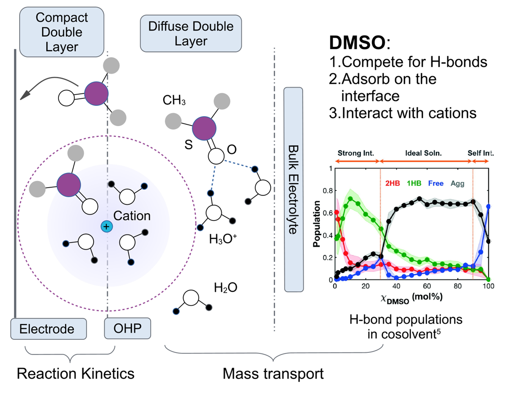
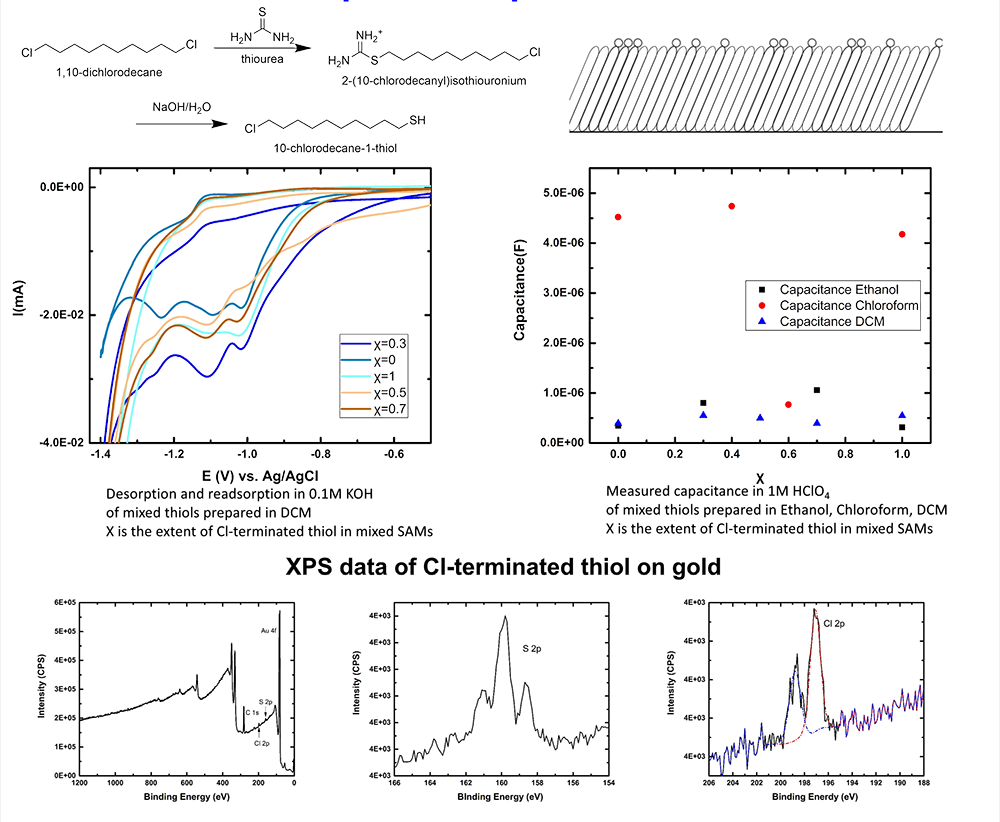
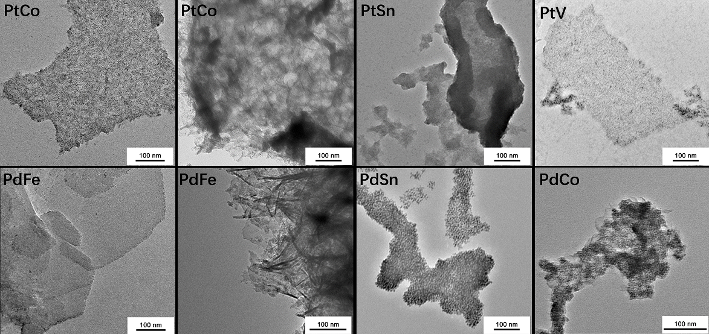

## Project Experience

*I have conducted research in various fields including biosensors, organic total synthesis, electrocatalysis and interface science. My variety of research experiences have given me a rigorous intuition about combining knowledge from different subfields. This intuition helps me keep an open mind when I encounter problems.*

*Sept. 2020 — Dec. 2023*

**Graduate student** at **Nature Science College**, UT 
on Spectro-electrochemical study on Hydrogen Evolution Reaction (HER)*. 

* Utilized attenuated total reflection surface-enhanced infrared absorption spectroscopy (ATR-SEIRAS) to identify the hydrogen bond network at the electrode-electrolyte interface
* Conducted precise measurements of HER kinetics and mass transport in the DMSO-water cosolvent system using ultra-microelectrodes. 
* Revealed disruption of the interfacial H-bond network by H-bond competitor has an additional non-trivial impact on the HER kinetics besides mass transport and reaction sites. 

*Jan. 2019 — July 2020*  
**Graduate student** at **Willard Henry Dow Laboratory** , [UMICH](http://umich.edu/) 
*Mentored by Prof. [Charles McCrory](https://scholar.google.com/citations?hl=zh-CN&user=gFH5HogAAAAJ) on Reductive Desorption of Mixed Self-assembled monolayer*.

* The mismatching between desorption onset potential and turning point of extent change might be caused by the bulky ferrocene-capped tail group, which makes it more likely to leave the surface than decanethiol.
* Applying Cl-terminated thiol instead of Ferrocene-capped thiol. Cl-thiol was synthesized by hydrolysis of thiourea.
* X-ray photoelectron spectroscopy (XPS) was used to investigate the changing extent of Cl-terminated thiol before and after reductive desorption.
* Cl-terminated thiol shows poor solubility in ethanol, hard to form mixed SAMs with decanethiol in ethanol.
* A phase separation occurred in mixed SAMs prepared in chloroform. 
* For SAMs prepared in DCM, it might form an evenly blended phase when the molar ratio of Cl-thiol is 0.5.

*July 2017 — Jan. 2018*  
**Research Intern** at **The Roger Adams Laboratory** , [UIUC](http://illinois.edu/) 
*Mentored by Prof. [Hong Yang](https://scholar.google.com/citations?hl=zh-CN&user=WPntzc4AAAAJ) on Oxygen Evolution Reaction and the Electrochemical Activity Descriptors*. 

* Fabricated an OER catalyst with low overpotential and improved stability in acidic conditions, using lanthanide doping for lattice manipulation. 
* Proposed the relation between the OER activity and the atomic numbers of lanthanides. 

*Nov. 2016 — Present*  
**Undergraduate Researcher** at **College of Material engineering** , [SJTU](http://en.sjtu.edu.cn/) 
*Mentored by Prof. [Jianbo Wu](https://scholar.google.com/citations?hl=zh-CN&user=iQ_WfvsAAAAJ) on Two-Dimensional nano-structures.* 
**Publication**: CHEN, W., MA, Y., LI, F., **PAN, L.** et al. Strong Electronic Interaction of Amorphous Fe2O3 Nanosheets with Single‐Atom Pt toward Enhanced Carbon Monoxide Oxidation. *Advanced Functional Materials* 29, 1904278 (2019). [Link](https://onlinelibrary.wiley.com/doi/full/10.1002/adfm.201904278)

*The TEM images of 2D metal samples obtained by solvothermal methods, (a)(b)PdFe (1:18); (c)(d) PtCo (1:9); (e) PtSn (1:9); (f)PdSn (1:9); (g) PtV (1:9); (h) PdCo (1:9)*

* Synthesized 2D nanostructures comprising platinum group and iron group metals utilizing tungsten hexacarbonyl (W(CO)6) as the reducing agent in the solvent ethylene glycol
* Proposed the growing mechanism: Platinum catalyzes the ethylene glycol reduction to form a net-like polymer and induces the lateral growing of metal. 
* Obtained superior MOR activity compared to conventional platinum catalysts: the incorporation of iron group metals into the platinum structure increased the surface area and improved the adsorption capacity for active intermediates. 

*July 2015 — Oct. 2016* 
**Undergraduate Researcher** at **College of Chemistry**  
*Mentored by Prof. [Shuyu Zhang]() on Semi-Pinacol Rearrangement*.

* Trained in the total synthesis of spiro compounds using the semi-Pinacol rearrangement reaction. 

*Apr. 2015 — Mar. 2016* 
**Member of PRP Program** at **College of Chemistry** 
*Collaborate on Interdisciplinary Research Project of  Fluorescence Biochemical Probe.*

* Prepared a fluorescent probe for structural distinction of gluconate. 
* Proposed a new fulorescence-quenching model explaining exceptions in sodium gluconate recognition. 

### Other

* Failure Analysis Engineer
* Advanced Electrochemical Engineer

**Trainee Journalist at the *Global Science* magazine** (The Chinese Edition of *Scientific American*)

* gather information for stories, including conducting interviews, attending events, and verifying facts
* write news articles that are concise, accurate, and engaging
* [Sample](https://planetpolly.github.io/2019-01-27-Fermat-s-last-theorem/)

**Teaching Assistant / Research Assistant** 

* As a part of my graduate life
* prepare course materials, such as handouts, quizzes, and exams
* lead smaller groups of students in discussions or lab sessions to reinforce concepts introduced in lectures
* review scholarly articles and research papers to inform the direction of the research project
* design and carry out experiments or studies in a laboratory or field setting
